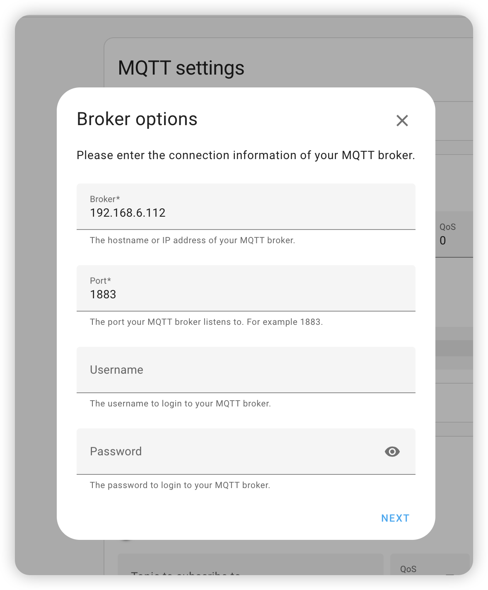
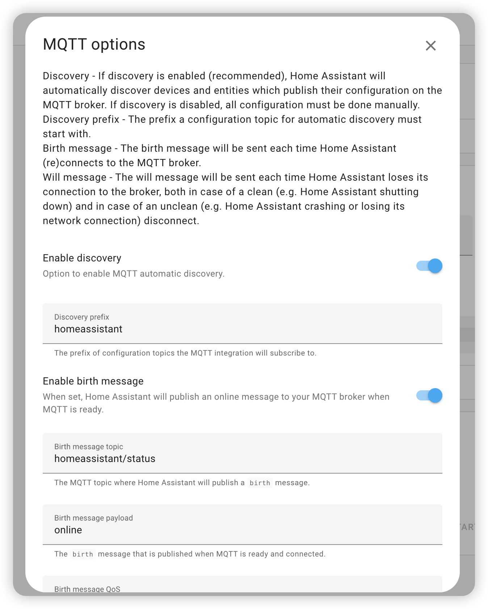
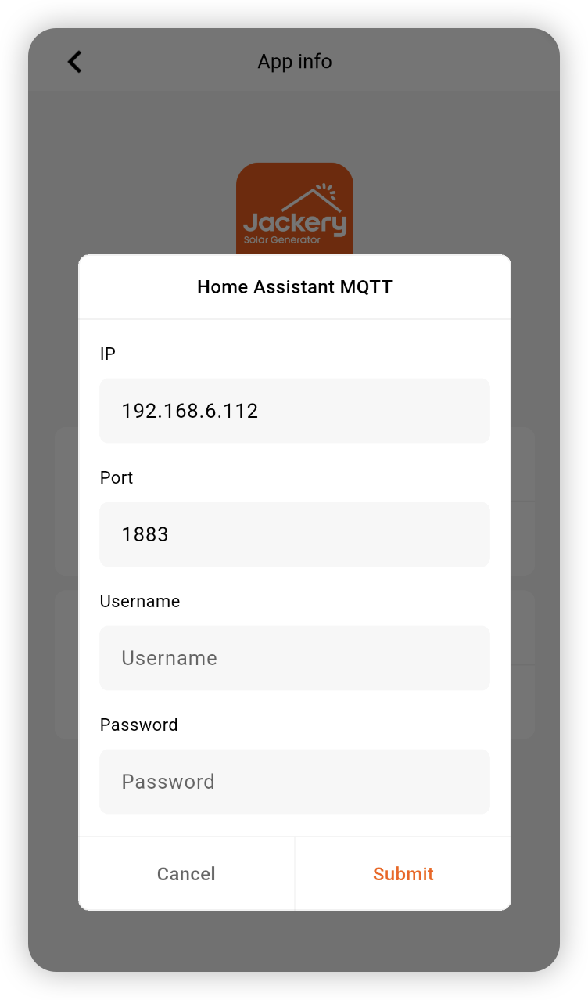
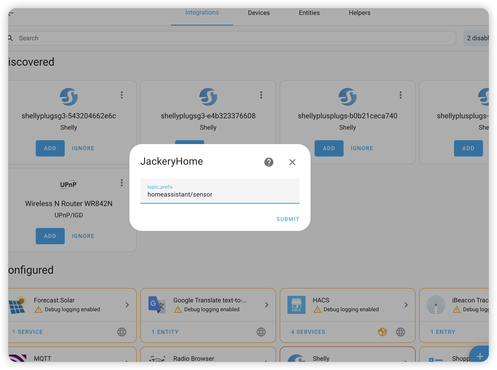
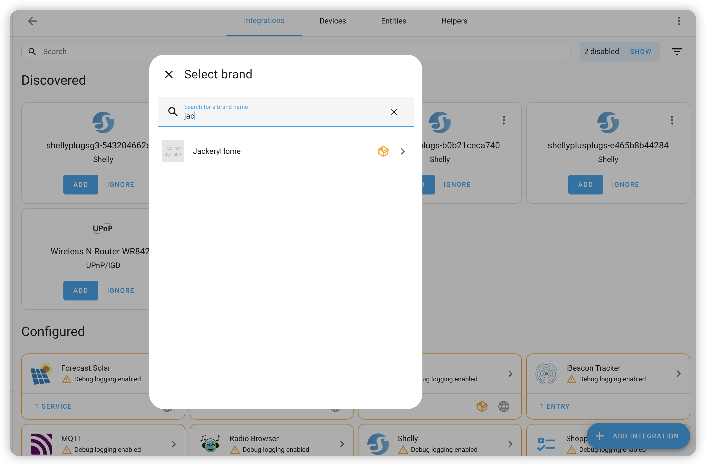
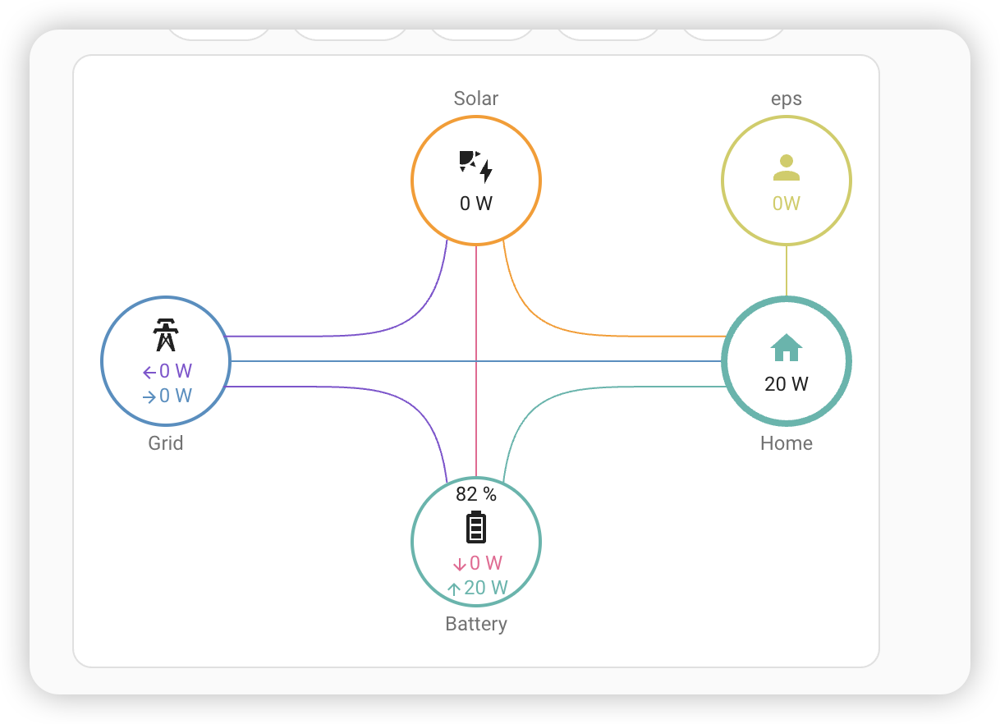

## JackeryHome – Home Assistant Energy Monitoring Integration

[](https://github.com/hacs/integration)
[](https://github.com/suyulin/jackery_home/releases)
[](LICENSE)

JackeryHome is a **custom Home Assistant integration** that uses **MQTT** to monitor solar, grid, battery, EPS and home energy data from a Jackery energy system.

The integration is implemented in `custom_components/JackeryHome/sensor.py` and is built around a shared **coordinator** (`JackeryDataCoordinator`) that efficiently manages subscriptions and data requests for all sensors.


### Features

- **Custom Home Assistant integration** (no YAML entities required)
- **MQTT-based data flow** with a shared `JackeryDataCoordinator`
- Periodic `data_get` requests every **5 seconds** for all sensors
- Real-time **power sensors** (W) and cumulative **energy sensors** (kWh)
- **Battery SoC** in percent with proper scaling
- Ready-to-use example configuration for **Energy Flow Card Plus**


### Prerequisites

Before the JackeryHome integration can receive any data, **two things must be in place**:

1. **MQTT broker/server is configured and reachable**
   
   - A running MQTT broker (e.g. Mosquitto, EMQX, etc.) is required.
   - Home Assistant's built‑in **MQTT integration** must be configured to connect to this broker.
   - The broker address, port, username/password (if any) should match what your device and simulator are using.
   - In your MQTT configuration, **replace the IP with the address of your own MQTT server**.
   
   
2. **Device is configured from the JackeryHome app**
   
   - Use the vendor/JackeryHome mobile app to add the device/gateway and complete its initial setup.
   - Make sure the device has network access and is configured so that it can connect to your MQTT/cloud backend.
   - In the Jackery Home app, long-press the app logo to open the configuration screen.
   - In the Jackery Home app configuration, **replace the IP with the address of your own MQTT server**.
   

---

### Installation

#### Option A: Install via HACS (recommended)

1. **Add custom repository**
   
   - Open HACS in Home Assistant
   - Click the three dots in the top-right → **Custom repositories**
   - Add repository URL: `https://github.com/suyulin/jackery_home`
   - Category: `Integration`
   - Click **Add**
2. **Install the integration**
   
   - In HACS, search for **"JackeryHome"**
   - Click **Install**
   - Restart Home Assistant
3. **Configure the integration**
   
   - Go to **Settings → Devices & Services → Add Integration**
   - Search for **"JackeryHome"**
   - Enter an MQTT topic prefix if needed (default: `homeassistant/sensor`)
   - Submit to finish configuration
  
  
> **Requirement**: The built-in **MQTT integration** must be configured and connected to your MQTT broker **before** JackeryHome will work.

### Example: Energy Flow Card Plus

You can use these sensors with the [Energy Flow Card Plus](https://github.com/flixlix/energy-flow-card-plus) Lovelace card.

#### Install the card

- Via HACS (recommended):
  
  - HACS → **Frontend** → search for **"Energy Flow Card Plus"** → install → restart HA.
- Manual:
  
  - Download from the GitHub repository.
  - Place files under `www/community/energy-flow-card-plus/`.
  - Add a Lovelace resource pointing to `/hacsfiles/energy-flow-card-plus/energy-flow-card-plus.js` (type: JavaScript module).

#### Basic configuration example

```yaml
type: custom:energy-flow-card-plus
entities:
  solar:
    entity: sensor.solar_power
    name: Solar
    icon: mdi:solar-power
  grid:
    entity:
      consumption: sensor.grid_import_power    # buying from grid
      production: sensor.grid_export_power    # selling to grid
    name: Grid
    icon: mdi:transmission-tower
  battery:
    entity:
      consumption: sensor.battery_charge_power      # charging
      production: sensor.battery_discharge_power    # discharging
    state_of_charge: sensor.battery_soc
    name: Battery
    icon: mdi:battery
  home:
    entity: sensor.home_power
    name: Home
    icon: mdi:home-lightning-bolt
display_zero_lines:
  mode: show
  transparency: 50
  grey_color: [189, 189, 189]
w_decimals: 0
kw_decimals: 2
color_icons: true
animation_speed: 10
energy_date_selection: false
```


### Notes & Requirements

- The MQTT broker must be running before you start the simulator or expect data in Home Assistant.
- The integration sends a single `data_get` request every 5 seconds for **all sensors**, reducing MQTT traffic.
- The device serial number (`device_sn`) is automatically obtained from LWT messages; no manual configuration is required.
- When the MQTT broker is unavailable, the coordinator logs a warning and retries automatically.
  

---

### Links

- **Energy Flow Card Plus** – `https://github.com/flixlix/energy-flow-card-plus`
- **Home Assistant MQTT Discovery** – `https://www.home-assistant.io/integrations/mqtt/#mqtt-discovery`
- **Home Assistant Developer Docs** – `https://developers.home-assistant.io/`
- **Paho MQTT Python Client** – `https://github.com/eclipse/paho.mqtt.python`

---

### License

MIT License

